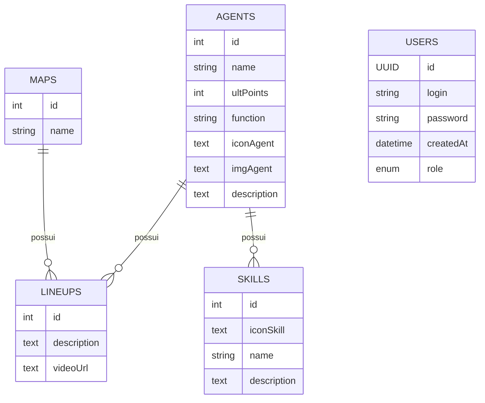

# Vava-API

      

API REST em **Spring Boot** com dados de agentes, skills e lineups do Valorant, mais autenticação de usuários com **JWT**. Ela é consumida por um frontend separado.

O catálogo (agentes, skills e lineups) é público e somente leitura. Cadastro, login e recuperação de senha são feitos por rotas de autenticação.

## Tecnologias

- Java 17, Spring Boot 3 (Web, Data JPA, Security, Validation, Mail, Actuator)
- PostgreSQL em produção e H2 em memória no desenvolvimento local e nos testes
- Autenticação stateless com **JWT** (java-jwt) e senhas com BCrypt
- Cache em memória com **Caffeine**
- Documentação **OpenAPI/Swagger** (desligada por padrão)
- Maven

## Recursos de performance e segurança

**Performance**
- Cache em memória (Caffeine) do catálogo inteiro: agentes, skills e lineups ficam 1 hora em cache. Os filtros por nome de agente ou mapa são feitos em memória, então a entrada do usuário nunca gera consulta ao banco.
- Cache HTTP nas rotas públicas: `Cache-Control: public, max-age=300` e `ETag`. Quando nada mudou, a API responde `304 Not Modified` sem corpo.
- Compressão das respostas JSON.

**Rate limit por IP** (token bucket em memória)

| Rota | Limite padrão |
|------|---------------|
| `POST /auth/login` | 10 por minuto |
| `POST /auth/register` | 10 por hora |
| `POST /auth/forgot-password` e `POST /auth/reset-password` | 5 a cada 15 minutos |
| Demais rotas | 120 por minuto |

Ao passar do limite a API responde `429 Too Many Requests` com o header `Retry-After`. Os limites podem ser alterados por variável de ambiente.

**Segurança**
- `JWT_SECRET` obrigatório, com no mínimo 32 caracteres. Sem ele a aplicação não sobe.
- Senhas com BCrypt e política mínima: 8 caracteres, maiúscula, minúscula, número e caractere especial.
- Token de recuperação de senha guardado como hash SHA-256 e com expiração. A rota de "esqueci a senha" sempre responde 200, para não revelar quais e-mails existem.
- Sessão stateless, CORS configurável e headers de segurança (HSTS, `X-Frame-Options`, CSP e `Referrer-Policy`).
- Swagger e console H2 desligados por padrão.
- Erros padronizados em JSON, sem stack trace nem detalhes internos.
- Admin inicial criado apenas se `ADMIN_PASSWORD` estiver definida. Não existe mais senha padrão.
- Validação de tamanho em todos os campos de entrada.

## Requisitos

- Java 17 ou superior
- Maven (ou o wrapper `./mvnw`)
- PostgreSQL para rodar com a configuração padrão

## Variáveis de ambiente

| Variável | Obrigatória | Descrição |
|----------|:-----------:|-----------|
| `JWT_SECRET` | Sim | Chave do JWT, mínimo 32 caracteres aleatórios |
| `PGHOST`, `PGPORT`, `PGDATABASE`, `PGUSER`, `PGPASSWORD` | Sim | Conexão com o PostgreSQL (SSL obrigatório) |
| `URL_RESET_PASS` | Sim | URL base usada no link do e-mail de recuperação de senha |
| `MAIL_USERNAME`, `MAIL_PASSWORD` | Sim | Conta SMTP. Use uma senha de app, nunca a senha da conta |
| `MAIL_HOST`, `MAIL_PORT` | Não | Padrão `smtp.gmail.com` e `587` |
| `CORS_ALLOWED_ORIGINS` | Recomendada | Origens permitidas separadas por vírgula. O padrão `*` libera qualquer origem, então informe o domínio do frontend em produção |
| `ADMIN_LOGIN`, `ADMIN_PASSWORD` | Não | Cria o admin inicial. Sem `ADMIN_PASSWORD` nenhum admin é criado |
| `JWT_EXPIRATION_MINUTES` | Não | Validade do token, padrão 120 |
| `TOKEN_EXPIRATION` | Não | Validade do token de reset de senha em minutos, padrão 5 |
| `CACHE_SPEC` | Não | Padrão `maximumSize=50,expireAfterWrite=1h` |
| `HTTP_CACHE_MAX_AGE` | Não | Segundos de `Cache-Control`, padrão 300 |
| `RATE_LIMIT_ENABLED` | Não | Padrão `true` |
| `RATE_LIMIT_GLOBAL`, `RATE_LIMIT_LOGIN`, `RATE_LIMIT_REGISTER`, `RATE_LIMIT_RECOVERY` | Não | Capacidade de cada regra |
| `FORWARD_HEADERS_STRATEGY` | Não | Padrão `native` (atrás de proxy). Use `none` se a API não estiver atrás de proxy |
| `JPA_DDL_AUTO` | Não | Padrão `update`. Em produção prefira `validate` com migrações |
| `DB_POOL_SIZE`, `TOMCAT_MAX_THREADS` | Não | Padrão 10 e 100 |
| `SWAGGER_ENABLED` | Não | `true` liga o Swagger em `/docs` |

Nunca coloque senhas ou chaves no repositório. Use sempre variáveis de ambiente.

## Como rodar

```sh
git clone https://github.com/KairoLab/Vava-API.git
cd Vava-API
```

**Desenvolvimento local (H2 em memória, sem precisar de banco nem de variáveis)**

```sh
mvn spring-boot:run -Dspring-boot.run.profiles=dsv
```

O perfil `dsv` liga o Swagger em `/docs` e o console do H2 em `/h2`, cria um admin de desenvolvimento e não envia e-mails de verdade. Use só na sua máquina.

**Com PostgreSQL**

Defina as variáveis da tabela acima e rode:

```sh
mvn spring-boot:run
```

**Testes**

```sh
mvn test
```

Os testes usam H2 e cobrem política de senha, JWT, rate limit e segurança das rotas.

## Endpoints

### Catálogo (público, somente leitura)

| Método | Rota | Descrição |
|--------|------|-----------|
| GET | `/agents` | Lista todos os agentes |
| GET | `/agents/{name}` | Busca um agente pelo nome (aceita apelidos como `kayo`) |
| GET | `/agents/{name}/with-skills` | Agente com suas skills |
| GET | `/media` | Lista todas as lineups |
| GET | `/media/agents/{name}` | Lineups de um agente |
| GET | `/media/maps/{mapName}` | Lineups de um mapa |
| GET | `/actuator/health` | Health check |

### Autenticação

| Método | Rota | Corpo |
|--------|------|-------|
| POST | `/auth/register` | `{ "login": "email@exemplo.com", "password": "Senha@123" }` |
| POST | `/auth/login` | `{ "login": "email@exemplo.com", "password": "Senha@123" }` |
| POST | `/auth/forgot-password` | parâmetro `email` |
| POST | `/auth/reset-password` | `{ "token": "...", "newPassword": "Nova@1234" }` |

Resposta do login:

```json
{ "token": "jwt_aqui" }
```

Para rotas protegidas, envie o header `Authorization: Bearer <token>`.

### Códigos de resposta comuns

| Código | Significado |
|--------|-------------|
| 400 | Dados inválidos, e-mail já usado, senha fraca ou token de reset inválido |
| 401 | Credenciais inválidas ou token ausente |
| 404 | Agente não encontrado |
| 429 | Limite de requisições atingido (veja `Retry-After`) |

## Modelo de dados

<details>
<summary>Diagrama Entidade-Relacionamento</summary>



</details>

Agentes têm várias skills e várias lineups. Mapas também têm várias lineups. Usuários são independentes e têm um papel (`ADMIN` ou `USER`).

## Deploy

1. Configure as variáveis de ambiente da plataforma (veja a tabela acima).
2. Defina `CORS_ALLOWED_ORIGINS` com o domínio do frontend.
3. Atrás de proxy, como Railway, mantenha `FORWARD_HEADERS_STRATEGY=native` para o rate limit enxergar o IP real do cliente.
4. Use o endpoint `/actuator/health` como health check.

## Futuras implementações

- Integração com OAuth2
- Migrações de banco com Flyway
- Atendimento e suporte ao usuário

## Licença

Este projeto está sob a licença MIT. Sinta-se à vontade para utilizá-lo e modificá-lo.
